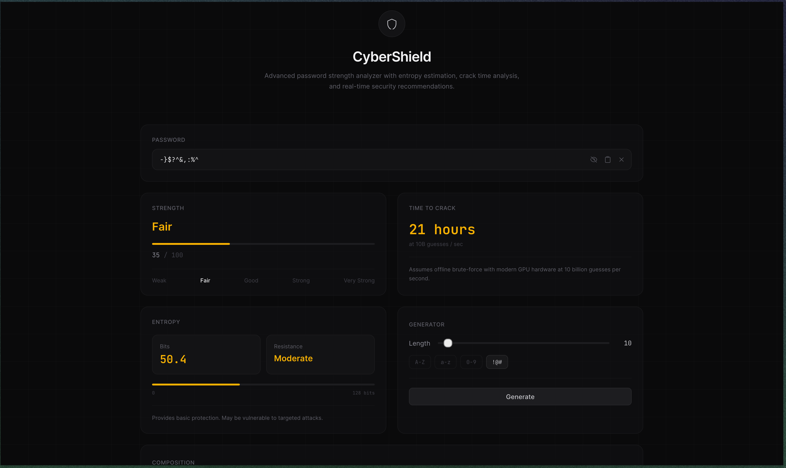
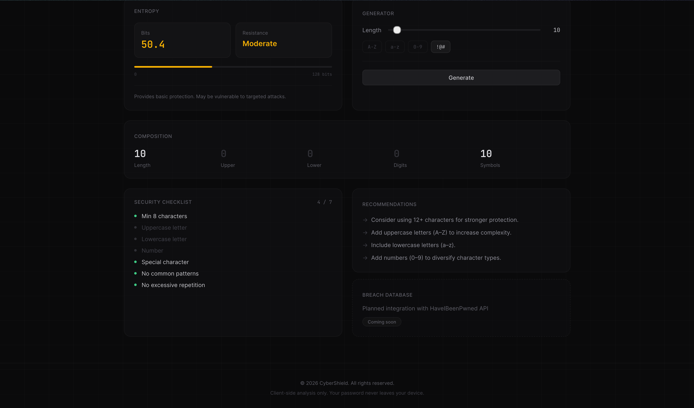

# CyberShield — Password Strength Analyzer

A modern, minimal password strength analysis tool built with **React**, **Vite**, and **Tailwind CSS**. Evaluates passwords in real time with visual feedback, entropy estimation, crack time analysis, and actionable security recommendations. 

Designed with a typography-driven 2026 aesthetic—clean, muted, and professional.

> **Privacy First:** All analysis is performed entirely in the browser. No data is ever transmitted to a server.

---

## 📸 Screenshots

*(Replace the paths below with your actual screenshot files before submitting your project)*


<br/>


---

## 🚀 Live Demo

**[View the Live Application on Vercel](https://password-strength-checker-pearl-seven.vercel.app/)**

---

## ✨ Features

| Feature | Description |
|---|---|
| **Real-time Analysis** | Instant feedback as you type — no submit buttons needed |
| **Strength Meter** | Progress bar with 5 levels (Weak → Very Strong) and score out of 100 |
| **Entropy Calculation** | Shannon entropy formula: `Entropy = Length × log₂(Character Set Size)` |
| **Crack Time Estimation** | Brute-force time estimate assuming 10 billion guesses/second |
| **Security Checklist** | 7-item live validation checklist with real-time pass/fail status |
| **Password Statistics** | Character composition breakdown (length, uppercase, lowercase, digits, symbols) |
| **Dynamic Recommendations** | Context-aware tips based on what's missing from your password |
| **Password Generator** | Cryptographically secure generator with configurable length and character types |
| **Minimal 2026 UI** | Clean typography, subtle zinc borders, and a muted color palette without visual noise |

---

## 🚀 Quick Start

```bash
# Clone the repository
git clone https://github.com/shaun6jrome/password-strength-checker.git
cd password-strength-checker

# Install dependencies
npm install

# Start the development server
npm run dev
```

Open **http://localhost:5173** in your browser.

---

## 🏗️ Project Structure

```text
src/
├── components/
│   ├── PasswordInput.jsx       # Input with inline show/hide, copy, clear
│   ├── StrengthMeter.jsx       # Progress bar + score/100
│   ├── SecurityChecklist.jsx   # 7-item live validation
│   ├── PasswordStats.jsx       # Character composition grid
│   ├── Recommendations.jsx     # Dynamic tips + breach check placeholder
│   ├── EntropyCard.jsx         # Entropy calculation + resistance level
│   ├── PasswordGenerator.jsx   # Secure random password generator
│   ├── CrackTimeCard.jsx       # Brute-force time estimation
│   ├── Header.jsx              # Minimal branding header
│   └── Footer.jsx              # Minimal footer
├── utils/
│   ├── passwordAnalyzer.js     # Regex-based scoring engine
│   ├── entropyCalculator.js    # Shannon entropy (L × log₂(N))
│   ├── crackTimeEstimator.js   # Time-to-crack based on entropy
│   └── passwordGenerator.js    # Crypto-secure password generation
├── App.jsx                     # Root component + responsive layout
├── main.jsx                    # Entry point
└── index.css                   # Minimal Tailwind globals
```

---

## 📊 Scoring Logic

### Base Scoring (0–100 points)

| Criterion | Points |
|---|---|
| Length ≥ 8 chars | 15 |
| Length ≥ 12 chars | 20 |
| Length ≥ 16 chars | 25 |
| Has uppercase letters | 10–15 |
| Has lowercase letters | 10–15 |
| Has numbers | 10–15 |
| Has special characters | 15–20 |
| 4 character types used | +5 bonus |
| Length ≥ 14 chars | +5 bonus |

### Penalties

| Pattern | Penalty |
|---|---|
| Common password pattern detected | −25 |
| Excessive character repetition (3+) | −15 |
| Length < 8 characters | −10 |

### Strength Levels

| Score | Label |
|---|---|
| 0–29 | Weak |
| 30–49 | Fair |
| 50–69 | Good |
| 70–89 | Strong |
| 90–100 | Very Strong |

---

## 🔐 Entropy Formula

```text
Entropy = Length × log₂(Character Set Size)
```

| Character Type | Pool Size |
|---|---|
| Lowercase (a–z) | 26 |
| Uppercase (A–Z) | 26 |
| Digits (0–9) | 10 |
| Symbols | 33 |

**Example:** A 12-character password using all types:  
`12 × log₂(95) ≈ 78.8 bits`

---

## 🛠️ Tech Stack

- **React 19** — Functional components with hooks
- **Vite** — Lightning-fast build tool
- **Tailwind CSS 3** — Utility-first styling
- **JavaScript (ES6+)** — No TypeScript, beginner-friendly
- **Web Crypto API** — Secure random password generation

---

## 🌍 Hosting & Deployment

This project is configured as a static site and is ready to be deployed for free on platforms like Vercel or Netlify. 

**Vercel Deployment:**
1. Connect your GitHub account to Vercel.
2. Import this repository.
3. Vercel will auto-detect Vite/React settings.
4. Deploy and receive a live URL instantly.

---

Built by [shaun6jrome](https://github.com/shaun6jrome)
